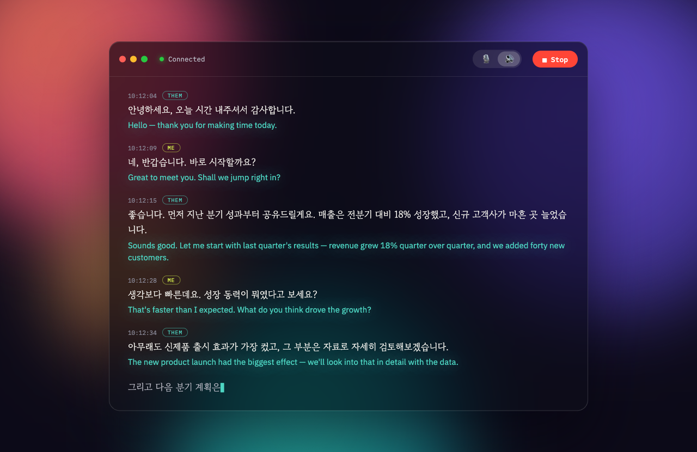
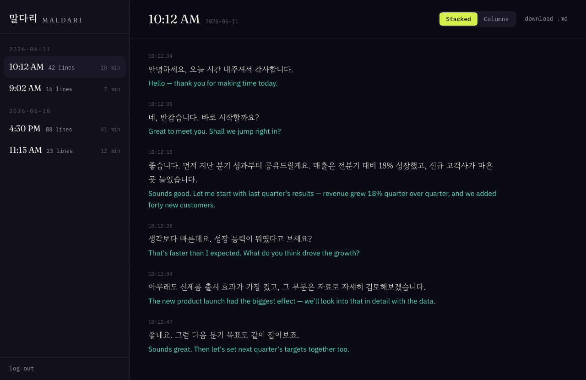

# 말다리 Maldari

**Live Korean↔English meeting translation for macOS.**

Maldari (말다리, "a bridge of words") sits in your meeting, listens to Korean
from the microphone or any app's audio, and writes English beneath it — line
by line, while people are still talking. Every session is saved locally as it
happens and mirrored to your own private website as dated markdown.

**Product page:** [maldari.johnnywon.com](https://maldari.johnnywon.com)



## What it does

- **Any voice in the room** — capture your mic or all system audio with a
  click, or right-click the source button to grab one specific app (Zoom,
  Meet, Teams).
- **Translation that keeps its word** — Claude renders business Korean into
  natural English and preserves commitment level (검토해보겠습니다 stays
  "we'll look into it", never "we will do it"). Filler (어/음/그) is
  recognized and skipped, not narrated.
- **Read it your way** — **Subtitle Mode** floats the latest lines as captions
  pinned to the top or bottom of whichever display you pick (caption size and
  color are yours, English optional) — handy on a video call when your camera
  is on one screen and the captions belong on another; **Always on Top** keeps
  the window above everything else; the options gear scales the transcript text
  on the fly.
- **Nothing is ever lost** — every finalized line appends to disk the moment
  it lands; a rolling markdown snapshot and cloud sync mean a crash, restart,
  or closed laptop can't eat the meeting.
- **Yours all the way down** — your Mac, your API keys, your Cloudflare
  account, your password. No third party reads your meetings.

Every session lands on your own site as dated markdown, behind your password:



## Install

Download the latest `Maldari.app` from
[Releases](https://github.com/johnnywon/maldari/releases/latest), or build
from source:

```bash
cd Translator
DEVELOPER_DIR=/Applications/Xcode.app swift build   # needs macOS 14.4+, Xcode
bash Scripts/make-app.sh Release                     # → build/Maldari.app
```

The release build is ad-hoc signed: on first launch, right-click → Open to
get past Gatekeeper, then grant Microphone and/or System Audio Recording
permission when prompted.

## Setup

1. **RTZR** (Korean streaming speech-to-text) — get a client ID/secret at
   [developers.rtzr.ai](https://developers.rtzr.ai), paste into
   Settings → API Keys. The free tier covers live captioning.
2. **Anthropic** (translation) — create an API key at
   [console.anthropic.com](https://console.anthropic.com), paste into
   Settings → API Keys. Translation runs on Claude Haiku with prompt caching;
   a one-hour meeting costs cents.
3. **Vocabulary** (optional) — add your company/product/people names in
   Settings → Transcription (keyword boosts + translation glossary).
4. **Cloud sync** (optional) — deploy [`web/`](web/README.md) to your own
   Cloudflare account, then put the endpoint + upload token in
   Settings → Cloud. Every session becomes readable (login-gated) at your
   domain minutes after it starts.

## How it works

```
mic / system audio → RTZR streaming STT (WebSocket)
                   → Claude translation (SSE, streamed tokens)
                   → live transcript (SwiftUI)
                   → ~/Library/Application Support/Maldari/sessions/   (live)
                   → your Cloudflare Worker + R2                       (mirror)
```

One SwiftPM app (`Translator/`), one Cloudflare Worker (`web/`). No other
infrastructure.

If a meeting ever misbehaves, structured JSONL diagnostics in
`~/Library/Logs/Maldari/` record every WebSocket drop, reconnect, translation
latency, and a 30-second heartbeat — enough to reconstruct exactly what
happened, after the fact.

## License

MIT — see [LICENSE](LICENSE).
